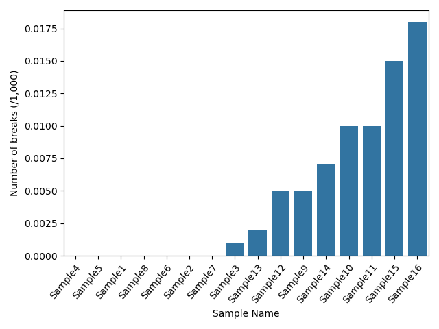

# Coding Test - Advanced -  Elves Duarte

## Background

This repo is the result of a coding test challenge described [here(https://gitlab.com/brokenstringbio/analysis/coding-test-advanced.git)]. I used the [Luigi module v3.4.0](https://luigi.readthedocs.io/en/stable/) (see [module versions here](python_installed_modules.txt)) to wrap a pipeline able to filter and intersect the input BED files, sum the number of breaks per sample, and generate summary result files such as a combined CSV file and bar plots.

The pipeline can be run by using the [wrapper python script](wrapper.py). The default command line arguments shall be able to get the input BED files and generate the summary result files. The following command line options are available:


```bash
usage: wrapper.py [-h] [--path-to-data-pipeline PATH_TO_PIPELINE] [--input-directory INPUT_DIRECTORY] [--min-read-quality MIN_READ_QUALITY] [--asisi-sites ASISI_SITES]
                  [--base-output-directory  BASE_OUTPUT_DIRECTORY] [--version]

Data Processing Pipeline Run the data processing pipeline to identify breaks in sequencing data Draft by: Elves H Duarte E-mail: ehelegam@gmail.com GitHub: Coding Test - Advanced
(https://github.com/ehelegam/bsb_coding_test)

options:
  -h, --help            show this help message and exit
  --path-to-data-pipeline PATH_TO_PIPELINE
                        Absolute path to the data processing pipeline
  --input-directory INPUT_DIRECTORY
                        Absolute path to the directory containing the input BED file.
  --min-read-quality MIN_READ_QUALITY
                        The minimun acceptable read quality.
  --asisi-sites ASISI_SITES
                        Absolute path to the target AsiSI sites.
  --base-output-directory  BASE_OUTPUT_DIRECTORY
                        Absolute path to the output base directory (i.e., where you want the output files). Defaults to the current working directory
```


## Input BED files

The input BED files were added to the repo by adding the coding test as a git submodule (command used below).


``` bash
git submodule add https://gitlab.com/brokenstringbio/analysis/coding-test-advanced.git
```


## Clone bsb_coding_test repo

``` bash
git clone --recurse-submodules https://github.com/ehelegam/bsb_coding_test.git
```


## Generate results __de novo__

Run the [wrapper python script](wrapper.py).

``` bash
# using all default options
# the results will be saved in the current working directory
python3 wrapper.py


# save the result in a diffent idirectory
# path-to-dir is the absolute path to a existing directory
python3 wrapper.py --base-output-directory path-to-dir
```

The pipeline will create the following folders and files (see an example of an [output folder here](2023_12_13_coding_test_results)):

``` bash
coding_test_results/
├── counts_filtered_break
│   ├── Sample10_filtered-breaks.csv.bed
│   ├── Sample11_filtered-breaks.csv.bed
│   ├── Sample12_filtered-breaks.csv.bed
│   ├── Sample13_filtered-breaks.csv.bed
│   ├── Sample14_filtered-breaks.csv.bed
│   ├── Sample15_filtered-breaks.csv.bed
│   ├── Sample16_filtered-breaks.csv.bed
│   ├── Sample1_filtered-breaks.csv.bed
│   ├── Sample2_filtered-breaks.csv.bed
│   ├── Sample3_filtered-breaks.csv.bed
│   ├── Sample4_filtered-breaks.csv.bed
│   ├── Sample5_filtered-breaks.csv.bed
│   ├── Sample6_filtered-breaks.csv.bed
│   ├── Sample7_filtered-breaks.csv.bed
│   ├── Sample8_filtered-breaks.csv.bed
│   └── Sample9_filtered-breaks.csv.bed
├── counts_unfiltered_break
│   ├── Sample10_unfiltered-break.csv.bed
│   ├── Sample11_unfiltered-break.csv.bed
│   ├── Sample12_unfiltered-break.csv.bed
│   ├── Sample13_unfiltered-break.csv.bed
│   ├── Sample14_unfiltered-break.csv.bed
│   ├── Sample15_unfiltered-break.csv.bed
│   ├── Sample16_unfiltered-break.csv.bed
│   ├── Sample1_unfiltered-break.csv.bed
│   ├── Sample2_unfiltered-break.csv.bed
│   ├── Sample3_unfiltered-break.csv.bed
│   ├── Sample4_unfiltered-break.csv.bed
│   ├── Sample5_unfiltered-break.csv.bed
│   ├── Sample6_unfiltered-break.csv.bed
│   ├── Sample7_unfiltered-break.csv.bed
│   ├── Sample8_unfiltered-break.csv.bed
│   └── Sample9_unfiltered-break.csv.bed
├── filtered_bed_files
│   ├── Sample10_filtered.bed
│   ├── Sample11_filtered.bed
│   ├── Sample12_filtered.bed
│   ├── Sample13_filtered.bed
│   ├── Sample14_filtered.bed
│   ├── Sample15_filtered.bed
│   ├── Sample16_filtered.bed
│   ├── Sample1_filtered.bed
│   ├── Sample2_filtered.bed
│   ├── Sample3_filtered.bed
│   ├── Sample4_filtered.bed
│   ├── Sample5_filtered.bed
│   ├── Sample6_filtered.bed
│   ├── Sample7_filtered.bed
│   ├── Sample8_filtered.bed
│   └── Sample9_filtered.bed
├── intersected_bed_files
│   ├── Sample10_intersected.bed
│   ├── Sample11_intersected.bed
│   ├── Sample12_intersected.bed
│   ├── Sample13_intersected.bed
│   ├── Sample14_intersected.bed
│   ├── Sample15_intersected.bed
│   ├── Sample16_intersected.bed
│   ├── Sample1_intersected.bed
│   ├── Sample2_intersected.bed
│   ├── Sample3_intersected.bed
│   ├── Sample4_intersected.bed
│   ├── Sample5_intersected.bed
│   ├── Sample6_intersected.bed
│   ├── Sample7_intersected.bed
│   ├── Sample8_intersected.bed
│   └── Sample9_intersected.bed
├── normalised_break_counts
│   ├── Sample10_normalised-counts.csv.bed
│   ├── Sample11_normalised-counts.csv.bed
│   ├── Sample12_normalised-counts.csv.bed
│   ├── Sample13_normalised-counts.csv.bed
│   ├── Sample14_normalised-counts.csv.bed
│   ├── Sample15_normalised-counts.csv.bed
│   ├── Sample16_normalised-counts.csv.bed
│   ├── Sample1_normalised-counts.csv.bed
│   ├── Sample2_normalised-counts.csv.bed
│   ├── Sample3_normalised-counts.csv.bed
│   ├── Sample4_normalised-counts.csv.bed
│   ├── Sample5_normalised-counts.csv.bed
│   ├── Sample6_normalised-counts.csv.bed
│   ├── Sample7_normalised-counts.csv.bed
│   ├── Sample8_normalised-counts.csv.bed
│   └── Sample9_normalised-counts.csv.bed
└── summary_results
    ├── break_counts_combined.csv
    ├── number_of_breaks_per_sample_norm_per_thousand.png
    ├── number_of_breaks_per_samplenorm_per_unfiltered_reads.png
    └── number_of_breaks_per_sample.png

7 directories, 84 files
```

## Findings

The barplot shows the normalised number of breaks (__y axis__) per sample (__x axis__).


